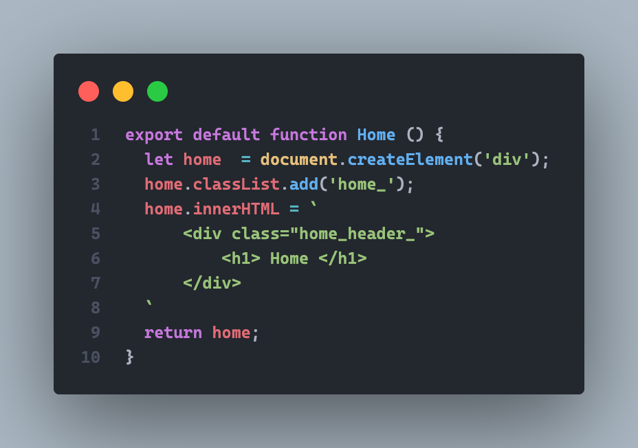
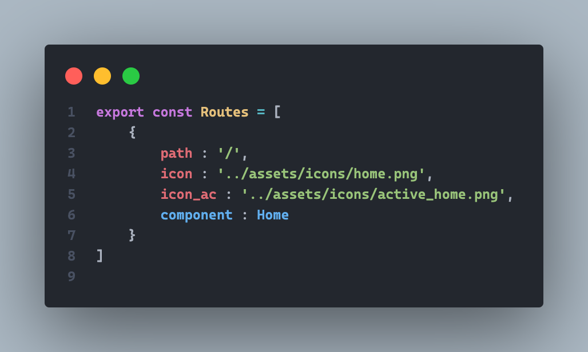

#HOW TO USE CUSTOM ROUTER : 

First create your page Component, for the clean working directory, you can add your page in the directory ./src/pages

  

 Then go to the routes array in ./src/routes/routes.js and append it to the array (the icon and icon_ac are just for sidebar links so don't worry about them) just set the path name and the component

  

<h2>Use navigate</h2>

Import the router object from {the path where you are}/routes/routes.js

it is used only to navigate the client to the new location

 Then you are ready to use navigate member function like:  

  

